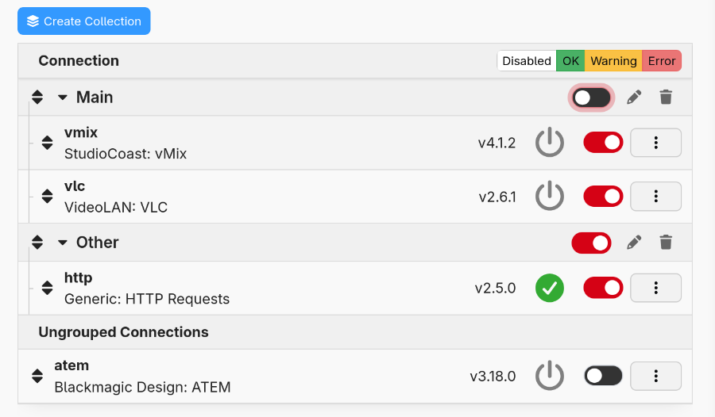
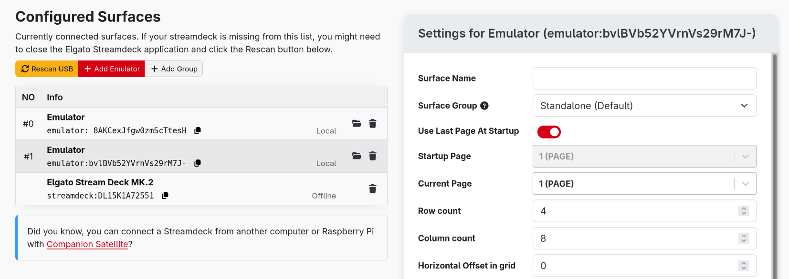
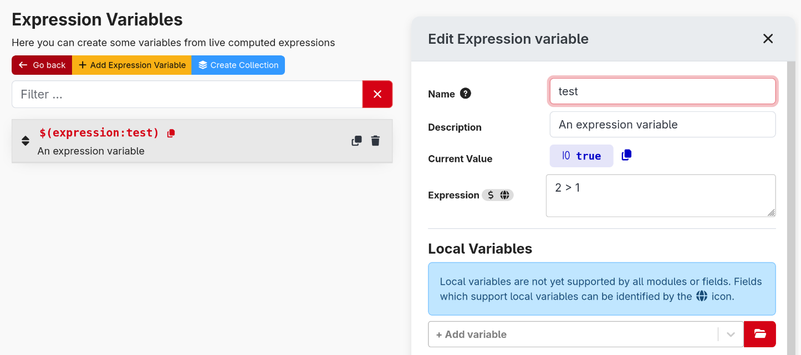

#### Ending support for macOS 11

This is the last version of Companion to support macOS 11. Starting with Companion 4.2 you will need to be running macOS 12 or later.

#### UI improvements

This release focuses on polishing the UI.

A major addition is "collections" — a way to group connections, triggers, or custom variables so you can manage or enable/disable them together. Collections make organising complex setups and toggling related items during events much easier.

We also made a number of small adjustments to improve clarity and flow, such as reworking table layouts in many places.

These changes prioritise organisation and usability so you can work more quickly.

#### Local variables

On each button or trigger you can now define local variables. These variables are scoped to that single button or trigger — they do not exist outside of it. Local variables can be configured in a few ways:

- Work like custom variables (can hold a static value and be changed by actions).
- Be expression-driven (value is the result of an expression evaluated when needed).
- Take the value of a feedback.

A key point: not all actions and feedbacks support local variables. Supported items will show a globe icon to indicate compatibility. We're working to broaden support; modules will add compatibility over time and further improvements are planned for 4.2.

#### Improving support for expressions

Expressions let you build more complex configurations and transform data flowing into or out of connections. They allow you to normalise, combine, or conditionally modify values before they're consumed or sent.

The new Expression Variables page lets you define variables computed from expressions. These can be referenced wherever connection or custom variables are accepted; their value is calculated from the expression you provide.

Expression variables can:

- Return a computed value from an expression.
- Depend on other variables, feedbacks, connection state, or local variables defined on a button/trigger (so you can break complex logic into sub-expressions or take input from feedbacks).
- Be used anywhere standard variables are used (actions, feedbacks, connection fields, etc.).

Notes:

- Circular dependencies between variables are possible but discouraged; they will be rate-limited and can incur a notable performance cost.

#### And more

- Various UX improvements
  - Connections, triggers and custom variables can be added to 'collections' for grouping
  - Connections and triggers can be enabled/disabled by their collections
  - Connections, triggers and surfaces tables have had their contents rearranged to flow more naturally
  - Surfaces has been reworked to utilise a right panel for the selected surface.
  - Any right hand panels of pages have been refined
  - Version number has moved into the sidebar instead of header
  - Improve clarity of beta module versions
  - Layout improvements of some pages on mobile
  - Indicate whether custom-variable value is valid while typing
  - Improved layout of the launcher window, including a new settings window
  - Add filter/search to triggers page
  - Improved import page
  - Improve emulator list page
- Added Expression Variables. Similar to Custom Variables, but their value is the result of an expression that executes when needed.
- Add new 'while loop' action
- Ability to define 'local variables' on buttons and triggers.
  - Not all actions or feedbacks support these, this will improve over time
- Additional expression functions
  - arrayIndexOf & arrayLastIndexOf
- Button step can be driven from an expression
- Multiple connections from the Elgato Stream Deck software are now supported.
- Support for Logitech MX Creative Console (buttons, not wheel)
- Support for MiraBox HSV293S
- Importing configs can be performed more granularly, without needing to reset everything
- Variables for installation name
- Expansion of the Ember+ api
  - Expose variables
  - Allow setting custom-variable values
  - Expose action recorder
- Support for 'secret' field types in connection config
- Attempt to keep screen awake in emulator/tablet views
- Support for defining custom backup rules
- Syslog support for logging
- Improve docker image command syntax
- UI can be hosted under a subpath when behind a reverse proxy
- Replace the library used for communication with the UI
  - This improves the type safety and code quality of this api and makes it easier for us to work with.
  - There should be no notable impact to users

##### 🐞 BUG FIXES

- Surface page settings not being persisted correctly in exports
- Load PNG button not always accepting files
- Help tooltips not always showing
- Some internal actions incorrectly claiming to support expressions
- Some dropdown fields not updating their options when expected
- Duplicating triggers first execution incorrect
- Improve drag and drop behaviour in action/feedback lists
- Sanitise page ids at startup, to ensure the config is sane
- Better handling when no compatible versions of a module are available to be installed
